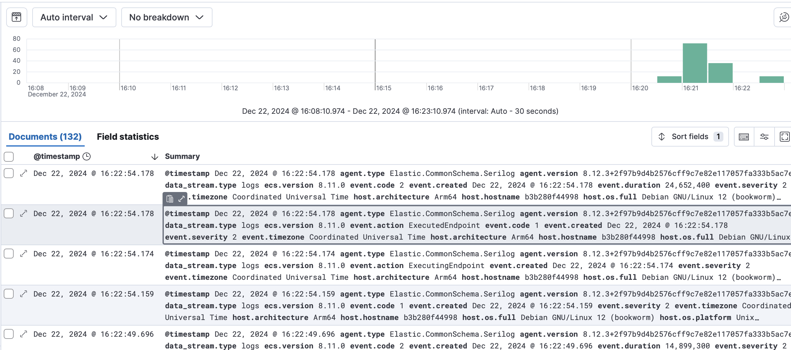
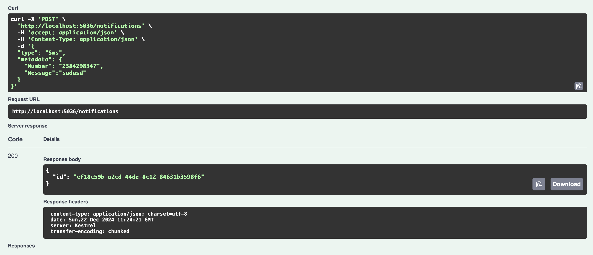
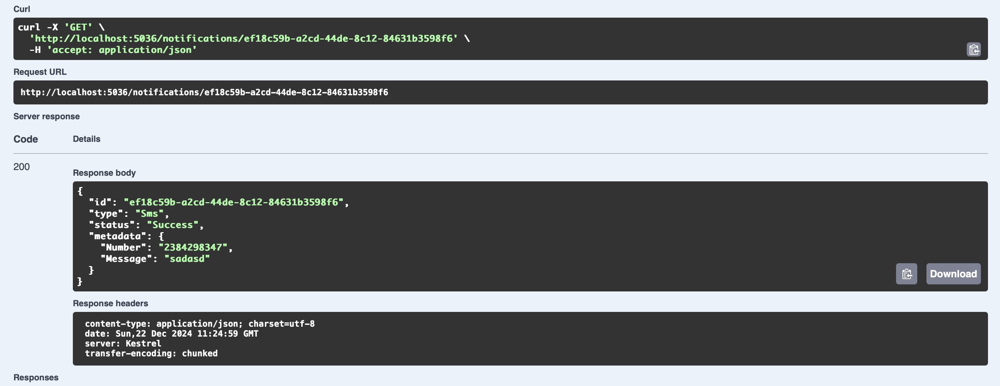
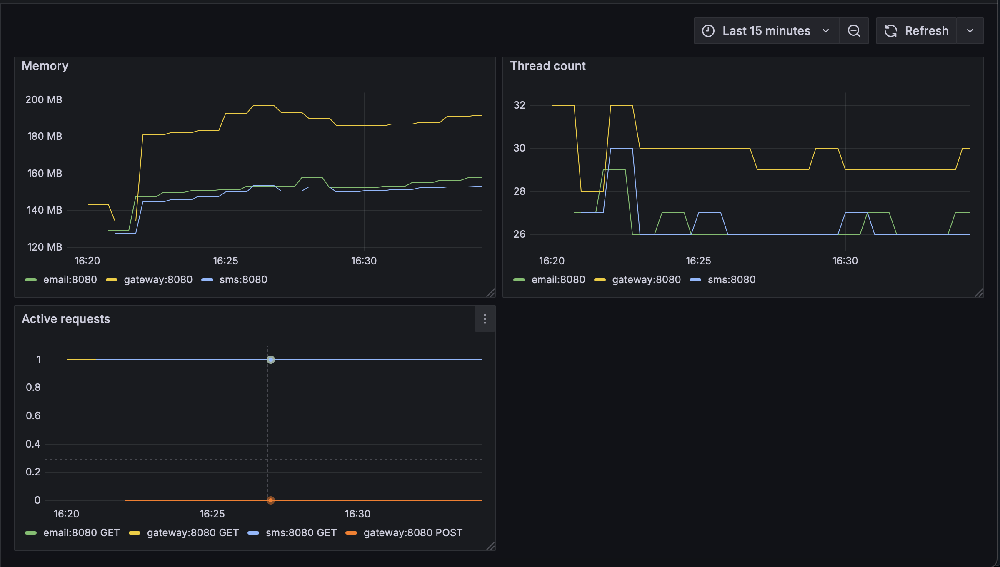
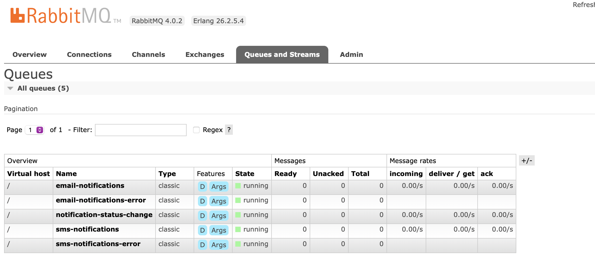

# Сервис уведомлений
Использованные технологии:
1. ASP.NET Core, C#, dotnet 8
2. RabbitMQ
3. MongoDB
4. Prometheus
5. Grafana
6. Elasticsearch + Kibana
7. Docker/docker-compose

Библиотеки:
1. MassTransit
2. Serilog
3. MongoDB.Driver

## Описание работы сервиса
Сервис имеет http rest-api из двух методов:
1. Отправить уведомление (sms или email) - `POST /notifications`
2. Получить уведомление - `GET /notifications/{id:guid}`

При отправке уведомления оно сохраняется в mongodb, ставится задача в очередь, далее исполняется демоном отвечающим за 
конкретный тип уведомлений.

Демоны - просто приложения на ASP.NET Core, без api. Не консольные для удобства.

## Скриншоты
1. Логи 
2. Отправка и получение состояния уведомления  
3. Графики с метриками в Grafana 
4. RabbitMQ admin с очередями 

## Как развернуть сервис
Для этого будет достаточно запустить все сервисы через docker-compose и немного подождать, далее на порту 5036 можно 
будет посмотреть swagger: `localhost:5036/swagger`

## Небольшое замечание
Сейчас в реальности уведомления не отправляются, но сделать это достаточно не сложно, 
достаточно просто написать логику внутри демонов

